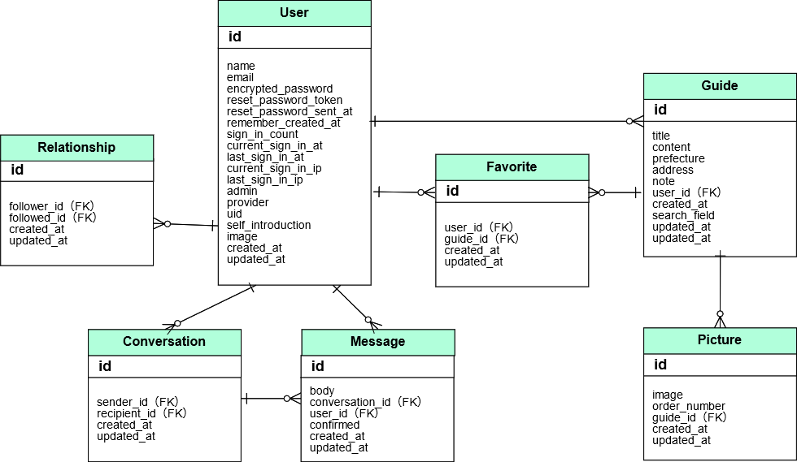

# README

## 開発言語

- Ruby 2.6.5
- Ruby on Rails 5.2.5


## 就業Termの技術

- お気に入り機能
- フォロー機能


## カリキュラム外の技術

- redcarpet
- coderay


## 実行手順

```
$ git clone git@github.com:grohno/tabishinan.git
$ cd tabishinan
$ bundle install
$ rails db:create db:migrate
$ rails s
```

## カタログ設計
https://docs.google.com/spreadsheets/d/15N__i0pILco3Wz9XMatDLV_lHYXFKZlO79KApjOZQbo/edit#gid=1484079240


## テーブル定義書
https://docs.google.com/spreadsheets/d/15N__i0pILco3Wz9XMatDLV_lHYXFKZlO79KApjOZQbo/edit#gid=658621163


## ワイヤーフレーム
https://cacoo.com/diagrams/usv5H8ytkbchd0r3/7A555


## ER図
https://cacoo.com/diagrams/wCTsWcQSTj4Q4wAQ/D0A83




## 画面遷移図
https://cacoo.com/diagrams/Spf2jPQf7Xh4Trp2/40B48


